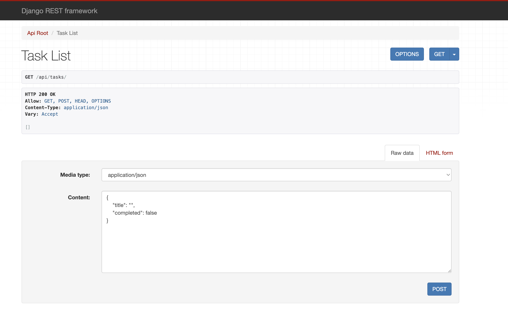
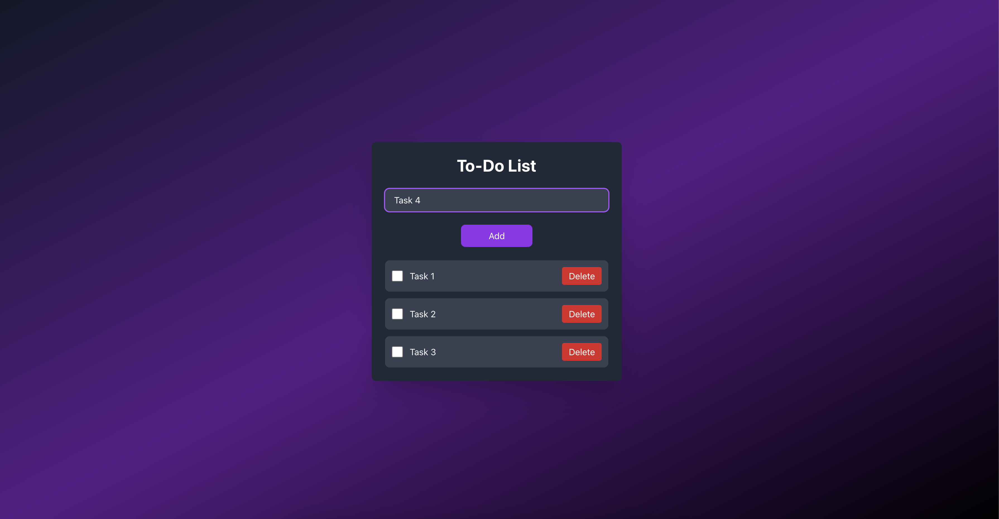

# Django + React (TypeScript) To-Do App

This is a minimal web application that allows users to manage a to-do list. The backend is built with Django and Django REST Framework, while the frontend is developed using React with TypeScript and styled with Tailwind CSS.

## Instructions to Run

### Backend (Django)
1.  Navigate to the `backend` directory: `cd backend`
2.  Create a virtual environment: `python3 -m venv venv`
3.  Activate the virtual environment: `source venv/bin/activate`
4.  Install dependencies: `pip install -r requirements.txt`
5.  Apply migrations: `python manage.py migrate`
6.  Run the server: `python manage.py runserver`
    * The API will be available at `http://localhost:8000/api/tasks/`.

### Frontend (React + TypeScript)
1.  Navigate to the `frontend` directory: `cd frontend`
2.  Install dependencies: `npm install`
3.  Start the development server: `npm start`
    * The app will be available at `http://localhost:3000/`.

## AI Usage
This code was generated with the assistance of an AI model.